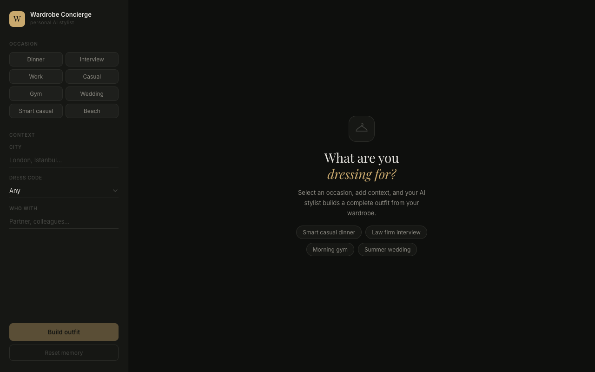
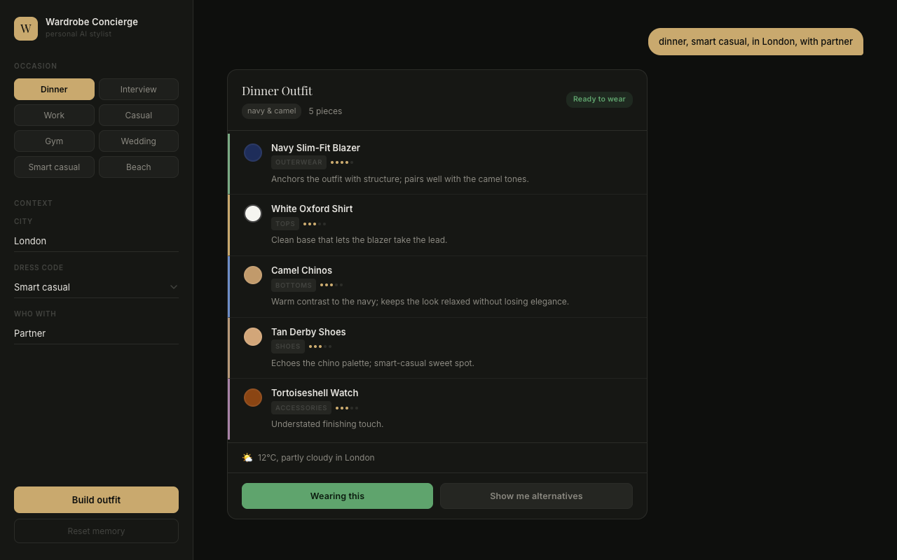

# Wardrobe Concierge

A multi-agent AI stylist that knows your wardrobe. Describe an occasion and it builds a complete outfit from your clothing items, checks weather and formality fit, detects missing pieces, and remembers what you have worn.





---

## Course Checkpoint Coverage

| Week | Topic | Implementation |
|------|-------|----------------|
| 5 | RAG 2.0 - Hybrid search | BM25 + ChromaDB vector search fused with RRF (k=60) over a 30-item wardrobe |
| 6 | GraphRAG | Neo4j palette coherence check; PAIRS_WITH / CLASHES_WITH edges steer outfit selection |
| 7 | RAGAS Evaluation + Model Strategy | Quality benchmark: Haiku vs Qwen3.5-9B across 10 queries (`results/benchmark.json`) |
| 8 | MCP Foundations | Weather MCP server (Open-Meteo + geocoding); Wardrobe SQLite MCP server |
| 9 | Building MCP Servers | Gap-finder agent: detects missing outfit categories, generates shopping search queries |
| 10 | Multi-Agent Workflows | LangGraph 7-node graph with fan-out/join: Manager -> Outfit -> [Occasion + Gap] -> Aggregate |
| 11 | HITL and Memory | LangGraph `interrupt()` approval gate + per-user JSON wear history (30-day repeat detection) |
| 12 | Small Model Strategy | Runtime model toggle: cloud (Claude Haiku, ~4s) vs local (Qwen3.5-9B via LM Studio, free) |

---

## What it does

- **Hybrid retrieval** - BM25 keyword search + ChromaDB vector search fused with Reciprocal Rank Fusion (k=60) over a wardrobe of 30 clothing items
- **Multi-agent graph** - 7-node LangGraph workflow: resolve context, search outfit, validate occasion (parallel), check gaps (parallel), aggregate, HITL gate, record wear
- **Real weather** - Open-Meteo geocoding + forecast API; outfit formality and layering adapt to conditions
- **Occasion validation** - Occasion Agent checks formality alignment (+/-1), weather mismatches (suede in rain, sandals in cold), and repeat wear within 30 days
- **Gap detection** - flags missing outfit categories (top, bottom, shoes, accessory) and generates shopping search queries
- **Human-in-the-loop** - LangGraph `interrupt()` pauses graph execution; wear history is never written silently
- **Per-user memory** - JSON store tracks every approved outfit; avoids repeating items worn for the same occasion within 30 days
- **Runtime model switching** - Settings toggle swaps between cloud (Haiku) and local (Qwen via LM Studio) without a server restart
- **LLM call history** - every model call is logged with token counts, cost, and full request/response JSON
- **Demo mode** - 11-step guided tour covering all 8 course checkpoints with spotlight highlights

---

## Architecture

```
User query
    |
    v
resolve_context          <- weather + user memory + formality inference
    |
    v
outfit_search            <- BM25 + ChromaDB hybrid search + LLM item selection
    |          \
    v           v
occasion_reason  gap_check     <- parallel fan-out
    |           /
    v          v
manager_aggregate        <- Neo4j palette check + FinalOutfit assembly
    |
    v
hitl_gate  <-- interrupt()    <- user approves or declines via /approve
    |
    v
record_wear              <- JSON memory update + wear log
```

**Models:** `claude-haiku-4-5-20251001` (all agents, default) or `qwen/qwen3.5-9b` (local via LM Studio)

**Stack:** LangGraph - ChromaDB - Neo4j AuraDB - rank-bm25 - FastAPI - sentence-transformers

---

## Project structure

```
personal-wardrobe-concierge/
├── data/
│   ├── seed/
│   │   ├── wardrobe_items.json    30 synthetic wardrobe items (seed=42)
│   │   └── wardrobe.db            SQLite wardrobe database
│   ├── eval/
│   │   └── ragas_queries.json     Evaluation queries
│   └── memory/                    Per-user wear history (runtime, gitignored)
├── results/
│   └── benchmark.json             Haiku vs Qwen quality/latency benchmark
├── scripts/
│   ├── generate_seed_data.py      Generates wardrobe items
│   ├── seed_all.py                Seeds SQLite + ChromaDB
│   ├── seed_neo4j.py              Seeds Neo4j graph (PAIRS_WITH / CLASHES_WITH)
│   └── benchmark_models.py        Haiku vs local model benchmark runner
├── src/
│   ├── models/                    GraphState TypedDict + Pydantic schemas
│   ├── db/                        SQLite, ChromaDB, Neo4j clients
│   ├── retrieval/                 Hybrid BM25+vector search, graph retrieval
│   ├── mcp/                       Weather MCP + Wardrobe MCP servers
│   ├── memory/                    Per-user JSON memory store
│   ├── llm/                       Unified LLM client, model router, call history log
│   ├── agents/                    Manager, Outfit, Occasion, Gap agents
│   ├── graph/                     LangGraph nodes + workflow
│   ├── eval/                      Evaluation harness
│   └── api/                       FastAPI server + static file serving
├── frontend/
│   ├── index.html
│   ├── style.css
│   └── app.js
└── docs/
    └── screenshots/
```

---

## Setup

### 1. Prerequisites

- Python 3.10+
- Anthropic API key
- Neo4j AuraDB Free account (optional - app degrades gracefully without it)

### 2. Install dependencies

```bash
pip install -r requirements.txt
```

### 3. Configure environment

```bash
cp .env.example .env
```

Edit `.env` - the minimum required fields:

```
ANTHROPIC_API_KEY=sk-ant-...
GEOCODING_API_KEY=...        # free key from api.api-ninjas.com (for city weather lookup)
WEAR_SECRET=any-random-string
```

Optional (Neo4j palette checking):
```
NEO4J_URI=neo4j+s://...
NEO4J_USER=neo4j
NEO4J_PASSWORD=...
```

Optional (local model via LM Studio):
```
LM_STUDIO_URL=http://localhost:1234/v1
```

### 4. Seed data

```bash
# Generate and seed SQLite + ChromaDB (required)
python scripts/generate_seed_data.py
python scripts/seed_all.py

# Seed Neo4j graph (optional - skip if no AuraDB credentials)
python scripts/seed_neo4j.py
```

### 5. Start the server

```bash
PYTHONPATH=. python src/api/main.py
```

Open `http://localhost:8000` in a browser. The API serves the frontend directly.

---

## API

| Method | Path | Description |
|--------|------|-------------|
| `POST` | `/outfit` | Build outfit for an occasion (runs graph to HITL interrupt) |
| `POST` | `/approve` | Approve or decline outfit (resumes suspended graph) |
| `GET` | `/profile/{user_id}` | Read user style profile |
| `PUT` | `/profile/{user_id}` | Update style profile (gender, style notes, fit preferences) |
| `GET` | `/memory/{user_id}` | Read user wear memory |
| `DELETE` | `/memory/{user_id}` | Clear user wear memory |
| `GET` | `/settings` | Read current model routing |
| `PUT` | `/settings` | Update model routing at runtime (no restart needed) |
| `GET` | `/llm-history` | All LLM calls since server start (tokens, cost, latency, JSON) |
| `DELETE` | `/llm-history` | Clear LLM call history |
| `GET` | `/health` | Health check |

### POST /outfit

```json
{
  "raw_query": "smart casual dinner tonight",
  "user_id": "user_001",
  "city": "London",
  "dress_code": "smart casual",
  "who_with": "partner"
}
```

Response:

```json
{
  "status": "awaiting_approval",
  "session_id": "abc123",
  "outfit": {
    "occasion": "dinner",
    "items": [...],
    "color_palette": "navy and camel",
    "ready_to_wear": true,
    "weather_summary": "12C, partly cloudy",
    "occasion_notes": "All items at formality 3 - appropriate for smart casual dinner",
    "gap_message": "Outfit is complete."
  }
}
```

### POST /approve

```json
{ "session_id": "abc123", "approved": true }
```

---

## How HITL works

The LangGraph workflow pauses at `hitl_gate` using `interrupt()`. The API returns `status: awaiting_approval` with the outfit and holds the graph state in MemorySaver (keyed by `session_id`). When `POST /approve` is called, the graph resumes via `Command(resume={"approved": bool})`. If approved the wear log is written; if declined the graph exits cleanly without writing anything.

---

## Week 12 - Small Model Strategy

### Runtime model routing

All agent roles are swappable without restarting the server.

**Via environment variable (persistent):**
```bash
OUTFIT_MODEL=claude-haiku-4-5-20251001   # default
OUTFIT_MODEL=qwen/qwen3.5-9b             # local via LM Studio
```

**Via Settings UI or API (runtime, no restart):**
```bash
curl -X PUT http://localhost:8000/settings \
  -H "Content-Type: application/json" \
  -d '{"outfit_model": "qwen/qwen3.5-9b"}'
```

The unified client (`src/llm/client.py`) dispatches to the Anthropic SDK for `claude-*` models and to the OpenAI-compatible endpoint for everything else.

### Benchmark results

Full results in `results/benchmark.json`. Summary across 10 outfit queries:

| Model | Avg Latency | Quality Score | Cost / 10 queries |
|-------|-------------|---------------|-------------------|
| `claude-haiku-4-5-20251001` | ~3.8s | 96.7% | ~$0.023 |
| `qwen/qwen3.5-9b` (LM Studio) | ~125s* | N/A | free |

*~12 tokens/s on consumer laptop hardware. Benchmark was interrupted after confirming the hardware bottleneck - see `results/benchmark.json` for the full finding.

**Haiku quality breakdown (10 queries):**

| Check | Pass rate |
|-------|-----------|
| Valid JSON | 100% |
| Has items | 100% |
| Item count (3-6) | 100% |
| Covers required categories | 100% |
| Formality aligned (+/-1) | 80% |
| Has item reasons | 100% |

**Qwen finding:** produces valid JSON with `/no_think` prompt suffix to suppress chain-of-thought tokens. At ~12 tok/s on consumer hardware each query takes 90-130s - impractical for interactive use. Viable on a GPU server or with a quantised smaller model.

### Running the benchmark yourself

```bash
# Haiku only (fast, ~40s for 10 queries)
python scripts/benchmark_models.py --models claude-haiku-4-5-20251001 --n 10

# Both models (Qwen requires LM Studio running on port 1234)
python scripts/benchmark_models.py --n 10 --output results/my_benchmark.json
```

---

## Demo mode

Click the **Demo** button in the top-right corner to start an 11-step guided tour. The tour auto-submits a live outfit query, spotlights each component as it explains it, and opens Settings automatically for the model routing steps. Steps covered: wardrobe seeding (W5), LangGraph workflow (W6), LLM routing (W7), memory store (W8), HITL gate (W9), weather integration (W10), occasion validation (W11), local model toggle (W12).

---

## Notes

- ChromaDB runs in embedded mode - no separate server needed. Persisted at `.cache/chroma/`.
- Weather uses Open-Meteo (free, no key) for forecasts and api-ninjas for city geocoding.
- Neo4j palette coherence is best-effort - the graph degrades gracefully if AuraDB is unreachable.
- `WEAR_SECRET` is injected only at the `record_wear` node; agents never see it.
- LLM call history is an in-process ring buffer (max 100 entries) - it resets on server restart.
